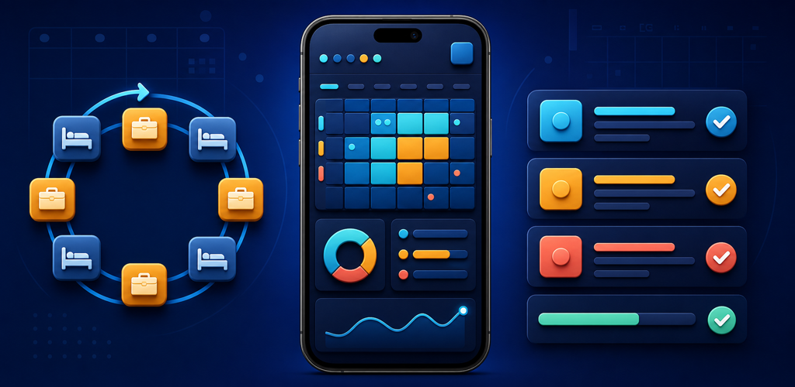

# Schedule & Tasks Android App

This native Kotlin and Jetpack Compose app combines the 4-on/4-off schedule planner with the task chart workflow. A bottom navigation bar keeps both tools available from one launcher while separate ViewModels own their state and persistence.



## Highlights

- Four-day schedule editing, cycle prediction, notes, category filters, and yearly calendar views.
- Python-compatible schedule JSON import and export with a 1 MB import limit.
- Short-term, long-term, and house renovation task categories from the Python source.
- Priority sorting that matches the Python app: High, Medium, Low, then task name.
- Add, edit, delete, complete, and reset task status actions.
- Per-category and overall progress summaries.
- Separate local save/load stores using app-private DataStore.
- JSON and Markdown exports through Android's system document picker.
- Android cloud backup and device-transfer extraction disabled for private planner data.
- Theme toggle with light and dark Material 3 styling.
- Adaptive launcher icons with Android 13 monochrome support.
- Release signing support via local `keystore.properties` or environment variables.

## Open In Android Studio

1. Start Android Studio (Flamingo or newer).
2. Select `File > Open...`.
3. Open the repository's `android-app` folder.
4. Let Gradle sync finish.

## Build Debug APK (Gradle)

1. Open a terminal in `/home/dave_m/android-app`.
2. If `./gradlew` does not exist yet, create the wrapper once:

```bash
gradle wrapper
```

3. Build the debug APK:

```bash
./gradlew assembleDebug
```

Note: Android Gradle Plugin `8.3.2` requires Java 17 (`JAVA_HOME` pointing to a JDK 17 install).

4. APK output path:

- Directory: `app/build/outputs/apk/debug/`
- File: `app/build/outputs/apk/debug/app-debug.apk`

## Saving & Loading

- `Save Local` / `Load Local` use app-private DataStore.
- Planner export writes a user-selected `intel_schedule.json` file compatible with the desktop prototype.
- Task export writes a user-selected `task_chart.md` file.
- Saved payloads stay inside app storage unless explicitly exported; Android backup and transfer exclude them.

## Release Builds

- Release signing is configured locally, not in source control.
- Copy `keystore.properties.example` to `keystore.properties` and fill in your keystore values, or export the matching `ANDROID_*` environment variables.
- Run `./gradlew printReleaseSigningStatus` to confirm the project sees your signing setup.
- Build a release APK with `./gradlew assembleRelease`.
- Build a Play Store bundle with `./gradlew bundleRelease`.

Detailed release and screenshot guidance lives in [RELEASE.md](./RELEASE.md).

## Contributing

For contributor expectations, workflows, and security practices, see the [Repository Guidelines](./AGENTS.md).
